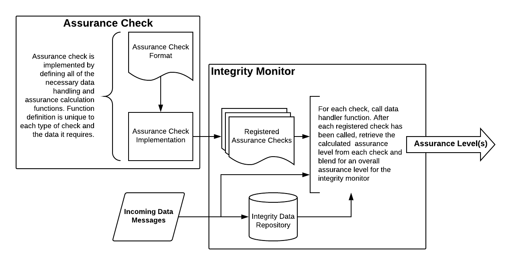
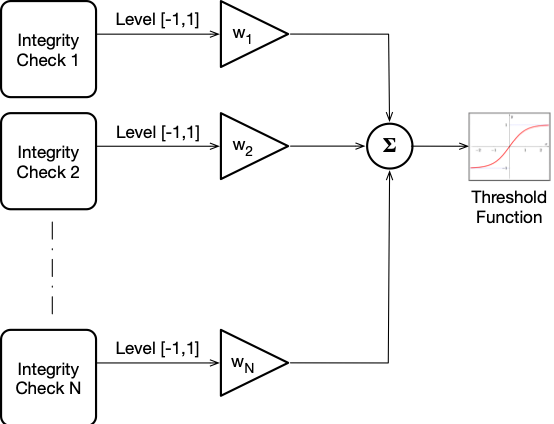
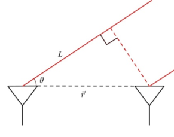
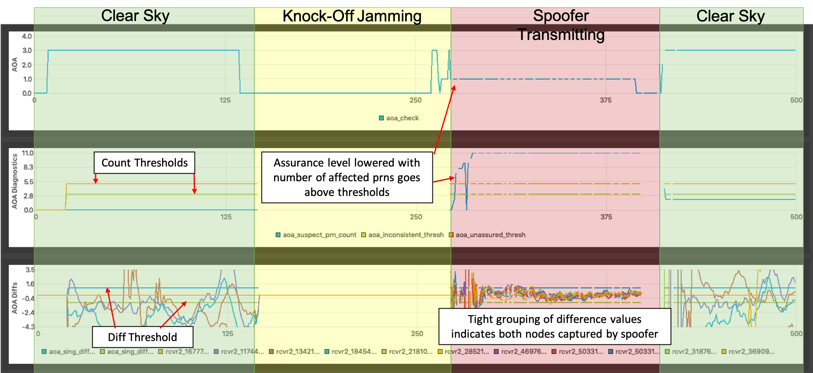
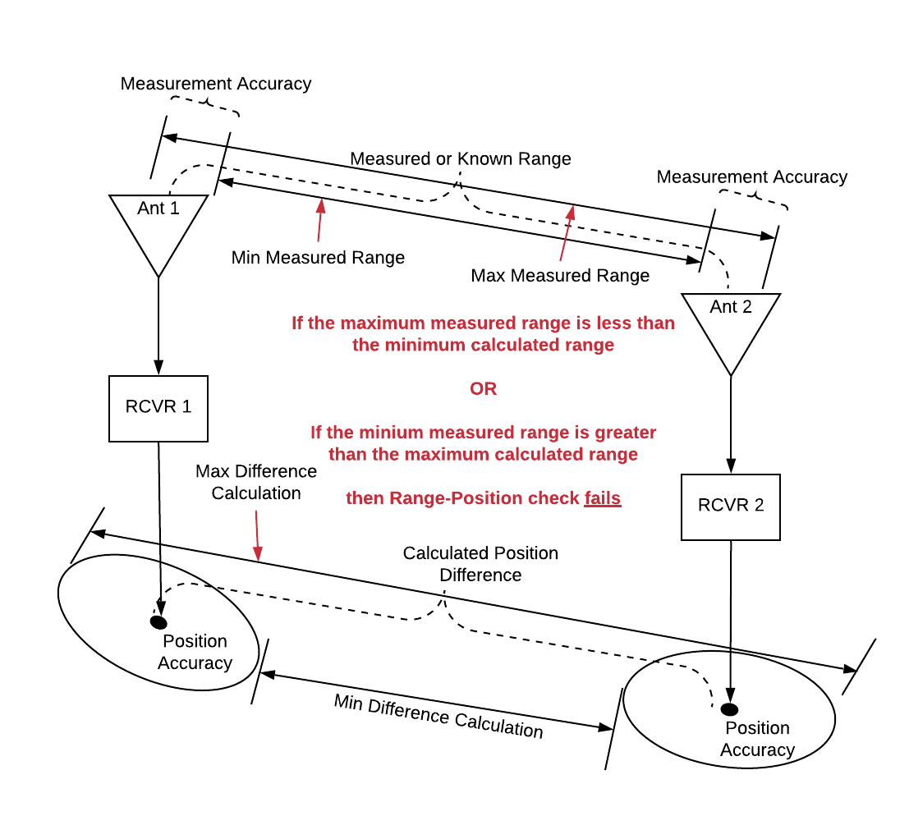
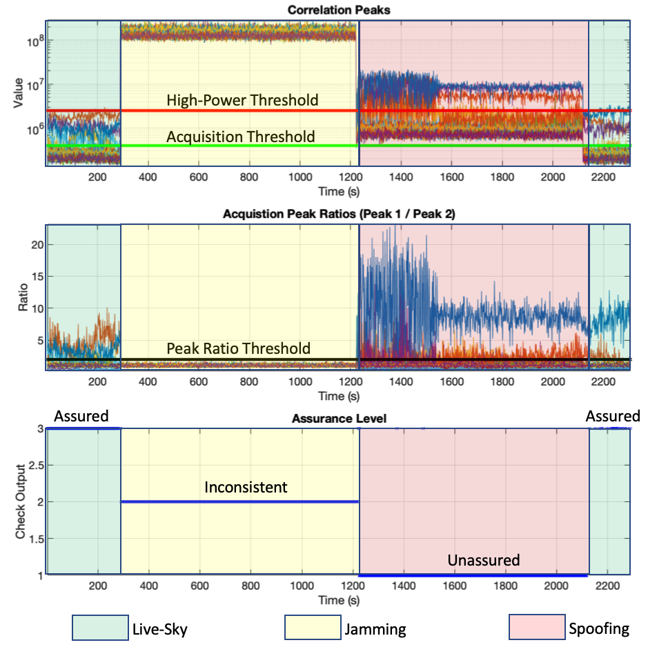
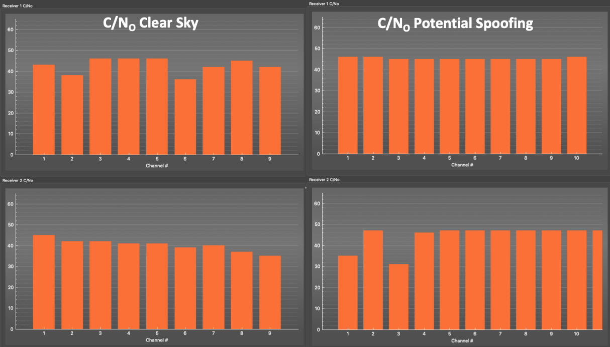
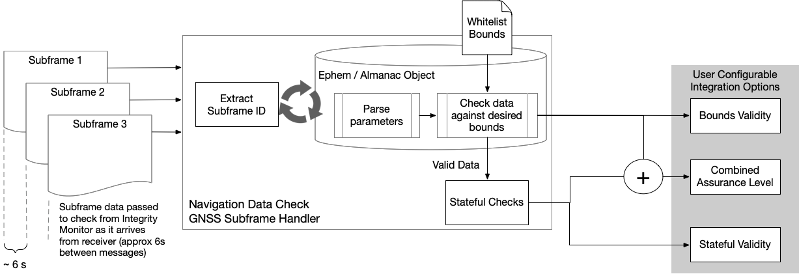
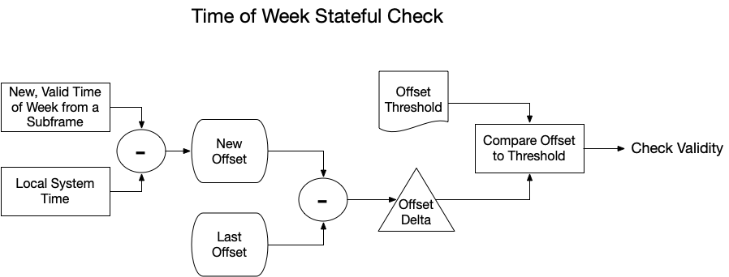
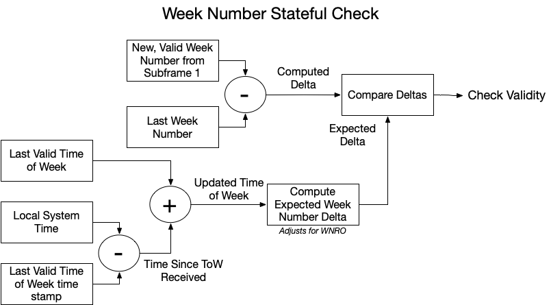

# The PNT-Integrity Library
The PNT Integrity Library provides a scalable framework for GNSS-based PNT manipulation detection that offers varying levels of protection based on the available data. The software is to be provided to GNSS receiver and GNSS-based timing server OEMs for use in future development or integration into existing products and platforms. 

The modular nature of the application allows additional checks to be added as new threats arise.  It also allows for the future addition of network-based data to further improve integrity.

## Framework Overview
The PNT Integrity Library can be used out-of-the-box with  existing, built-in integrity checks. The framework also allows additional, user-defined integrity check algorithms to be incorporated into the application. The figure below gives a high-level description of the framework and how user-defined modules can be included. 

@image latex doc/images/function_schematic.png

The initial release of this Library has the following built-in assurance / integrity checks:
	
* Multi-Antenna / Receiver Detection Methods
	* Angle of Arrival (AOA)
	* Range / Position Verification (for networked receivers)
* Signal-Power and Vestigial-Peak Detection Methods 
	* Spoofer signature detection in code / doppler 2D search
	* Automatic Gain Control (AGC) monitoring
* Model-based Consistency Checks
	* PNT discontinuities (time / position jumps)
	* Consistency checks (Carrier-to-noise, position/velocity)
  
## System Components
Each of the following sections describe each component of the framework in more detail.

### Blending Functions

The PNT-Integrity Library provides functionality for monitoring the integrity of single or multiple receiver outputs. It provides a confidence level on the receiver PVT solution(s) using a modular set of integrity checks based on receiver outputs and observables.  The output of each individual integrity check is weighted based on the effectiveness of that check.  The weighted outputs of all checks are then summed, and a threshold applied to determine a confidence level in the PVT solution as shown below.
 

@image latex doc/images/blending.png

Each individual integrity check returns an assurance level with a n associated numeric value for blending with other checks for a total level. This value, $l_i$,  will be either -1, 0, or 1. The table below defines the levels and their values. Note that the first assurance level, 'Unavailable', does not provide a value and therefore will not be used when calculating a total assurance level.  

| Level    	| Description                                                                 	| Enumeration  	|  Value 	|
|--------------	|-----------------------------------------------------------------------------	|--------------	|-------------	|
| Unavailable  	| Assurance level is unavailable (insufficient data or has not yet been run)  	| 0            	| N/A         	|
| Unassured    	| Indicates a high likelihood that the measurement / source cannot be trusted 	| 1            	| -1          	|
| Inconsistent 	| Cannot reliably determine the validity of the measurement / source          	| 2            	| 0           	|
| Assured      	| Indicates a high likelihood that measurement / source can be trusted        	| 3            	| 1           	|

A weight, wi, is assigned to each check to indicate the relative accuracy in determining the integrity level.  The weighted sum (L') of these N individual levels li is then calculated:

@image latex doc/images/L-prime.png

*Note: Weights must be positive and cannot all be 0.*

Weights are normalized for faster implementation:

@image latex doc/images/wi_prime.png

The resulting level, L', is then thresholded to determine the overall integrity output L, which is then mapped to an overall assurance level using the values given in the table above.

@image latex doc/images/L_bracket.png

For a simple rounding scheme, use the following thresholds:

@image latex doc/images/thresholds.png

#### Positive Weighting Exception
In some situations it may be desirable to only weight certain assurance checks in the negative direction (i.e. when the check is attempting to lower the overall assurance level). For example, if a certain check should only be used to lower the overall assurance level and not keep it raised. Each assurance check has an internal flag used to indicate whether or not it allows positive weighting. Currently, this flag is hard-coded for each check Future versions of the software will allow this to be an input parameter. The table below shows which checks allow positive weighting and which do not.

### Assurance Check
The "AssuranceCheck" module is a virtual object within the framework, meaning that it cannot be directly used, but rather a specific implementation must inherent its interface in order to be incorporated into the integrity monitor. As previously mentioned, several existing assurance check definitions are included out-of-the-box with the framework. An integrated application must either define a new/custom assurance check(s) or use existing, pre-defined check(s). Refer to the included software documentation for details on how to implement a user-defined check. The included example application can be referenced on how to incorporate, initialize, and use the built-in checks.

The Assurance Check base class contains all data and functions that are common to every assurance check child derivative class. As an example, the parent class contains a setting known as the assurance level period. This setting defines how long each check must hold a lowered assurance level before it can be raised again. If a child check detects that the level should be lowered to indicate an attack, this level change is allowed immediately. However, if the child check decides that the attack condition is no longer present, the check must hold previously lowered value for this pre-determined amount of time. This single-sided hysteresis is intended to prevent level "flickering."

### Integrity Monitor
The "IntegrityMonitor" module is the primary component that the user application will interface with. All assurance checks, both user-defined and built-in, must be registered with the integrity monitor, which will keep a vector of all registered checks. The enclosing application will then pass all received data messages to the integrity monitor for processing as they are received. The monitor will cycle through all registered checks, calling the appropriate data processing function in each check. After all checks have been called, the monitor will then extract the calculated assurance level from each check and blend them for an overall result.

### Integrity Data Repository
A time history of received integrity data is available for use by the built-in and user-defined assurance checks. The repository has a time-history length that can be controlled with a setting. Repository use is not required for user-defined checks, but it is accessible if desired. See the attached documentation on how to utilize the repository.

### Data Structures
Refer to the software documentation in later chapters for details on the data structures used in the framework.

## Included Assurance Checks
The table below lists the out-of-the-box assurance checks that are packaged with the library. The table shows which checks allow positive weighting, the class of check, and the resilience level associated with each check. A definition of the resilience levels and how they apply to a PNT system can be found [here](link).

| Check Name                          	| Allows Positive Weighting 	|         Assurance Check Class         	| Resilience Level 	|
|-------------------------------------	|:-------------------------:	|:-------------------------------------:	|:----------------:	|
| Angle-of-Arrival (AOA) Check        	|            Yes            	|          Multi-Antenna / Node         	|         2        	|
| Range-Position Check                	|            Yes            	|          Multi-Antenna / Node         	|         1        	|
| Automatic Gain Control (AGC) Check  	|            Yes            	| Signal Power and Peak Detection (CAF) 	|         2        	|
| Acquisition Check                   	|            Yes            	| Signal Power and Peak Detection (CAF) 	|         3        	|
| Static-Position Check               	|            Yes            	|        Model-Based Consistency        	|         1        	|
| Position-Jump Check                 	|            Yes            	|        Model-Based Consistency        	|         1        	|
| Position-Velocity Consistency Check 	|            Yes            	|        Model-Based Consistency        	|         1        	|
| Clock-Jump Check                    	|            Yes            	|        Model-Based Consistency        	|         2        	|
| Carrier-to-Noise (CNo) Check        	|             No            	|        Model-Based Consistency        	|         2        	|

## Multi-Antenna Detection Algorithms
Multiple receivers / antennas connected a system can be leveraged to form power assurance checks. Two such checks included with the PNT Integrity Library are described in the following sub-sections.

### The Angle of Arrival Check
The most effective method for detecting GPS spoofing is using angle of arrival (AOA) with multiple receiver antennas. This method can be implemented using a single receiver with multiple antennas or multiple independent receivers with an available network connection for sharing data. Relative pseudorange or carrier phase from each antenna in an array is a function of the angle of the arriving signal, as shown in the figure below. 

@image latex doc/images/aoa.png height=100px

To determine the AOA, pseudorange or carrier phase measurements from two antennas are subtracted to produce a single differenced observable. The AOA is dependent on the satellite position in the sky (and platform attitude). As a result, the phase differences will vary from channel to channel. However, during a spoofing attack, the AOA of every captured channel will converge to the same value as all signals will be propagating from the same source. 

The figure below demonstrates the calculations and logic used inside the AOA check.
Single differences are computed between common prn psuedoranges (or carrier-phases) 
between two communicating nodes (node = receiver + antenna). Under clear-sky
conditions, the difference values are separated (providing that the receiving 
antennas are separated sufficiently). When both nodes become captured by the
spoofer, the difference values collapse to a tight grouping. The algorithm 
counts the number of prns that are within the difference thresholds and sets the
level according to a separate set of thresholds (count thresholds).

@image latex doc/images/aoa_diffs.png height=100px

### The Range-Position Check
If the distance between two antennas is known (or measured), a simple but effective assurance check can be achieved by comparing the measured range to the differenced position of the two antennas. A differenced position is computed by taking the absolute value of the position of receiver A minus the position of receiver B. This computed range is then compared to the measured range between the two antennas. Taking position and range measurement variances into account, the two are compared to see if the difference is within reasonable tolerances. If either receiver (or both) is captured by the spoofer, then this check can be a reliable indicator of a position-based spoofing attack. Obviously, this check will not be reliable when both antennas are close together, as the range measurement will not be large enough to invalidate a position difference, regardless of spoofer effectiveness.

@image latex doc/images/rng_pos_check.png

## Signal Power and Vestigial Peak Detection Algorithms

### Acquisition Check
Often a jammer will be used in conjunction with a spoofer in order to raise the noise floor and hide the authentic signal.  Other times the spoofer will transmit at much higher power levels than the live-sky signal in order to cover a large area or due to mis-calibration (a very difficult process). One straightforward way of detecting spoofers is by closely monitoring the power levels of the signals in the acquisition process. Despite the fact that the GPS signal transmission was designed to provide roughly constant power from horizon to horizon, there are still power level differences of three to six decibels from horizon to zenith. By knowing the possible power change across the satellites path, the amount of amplification coming from the antenna, amplification from low noise amplifiers, and using previously known correlation values, a range of possible correlation values can be determined and set as a threshold. Should any correlation value be higher than the threshold, it is likely from an attack and can be quickly detected.  

The acquisition check currently implemented in this library takes IF data snippets from a receiver front end, runs a signal acquisition process, and then monitors the correlator outputs for suspect power levels . Each tracking channel (up to 32 for GPS L1) is assessed independently and then aggregated to form a composite assurance level for the check. For each channel, the highest two peaks in the signal correlation plane are selected. If the highest peak is above a threshold, then this channel is considered to be suspect. If PRN is considered to be acquired in this high-power state (i.e. when the ratio of peak1 to peak 2 is above the threshold), then it is flagged as "unassured" to indicate a possible attack. If it is not acquired in this high-power state, then it is flagged as "inconsistent" to indicate possible jamming. If the peak 1 value is below the high-power threshold, but still above the acquisition threshold, then that PRN is considered to be acquired in safe state and is acquired as "assured". Otherwise, the PRN is flagged as "unavailable" (i.e. the satellite is not in view). The number of PRNs in each state are summed and passed through the following logic to determine the assurance level for any given time.

	if (unassuredCount >= assuranceUnassuredThresh_)
    {
		level = UNASSURED
    }
    else if (inconsistentCount >= assuranceInconsistentThresh_)
    {
		level = INCONSISTENT
    }
    else if (assuredCount >= assuredThresh)
    {
		level = ASSURED
    }
    else
    {
		level = UNAVAILABLE
    }

The figure below shows output data from the Acquisition Check during a "knock-off-then-spoof" attack. The check is tuned to produce an overall level of "Inconsistent" in a pure-jamming environment and "Unassured" when it is being spoofed.

@image latex doc/images/acq_check.png

### Automatic-Gain Control (AGC) Check
A relatively simple check for a jamming / spoofing attack can be achieved by monitoring the output of the receiver's automatic gain control (AGC). An AGC is a common component in any radio device, and attempts to regulate the incoming signal to a desired level to optimizes the downstream signal processing. If the incoming power level is high, the AGC will lower its gain so that the incoming signal will not saturate. Conversely, if the incoming power level is low, the AGC will increase its gain to boost the signal for better signal processing and data demodulation. By simply monitoring the current AGC setting of the receiver (provided that it is available), a user (or detection software) can gain a good sense of what might be happening in the signal environment.

In this library, the AGC check implementation simply monitors the AGC setting (in all available bands), normalizes its current value, and compares it to a threshold to indicate attack. To operate this check, the minimum and maximum setting values for the AGC must be known. In addition, this check is currently tuned so that the assurance level of the check is only raised to "Inconsistent." On its own, the AGC check cannot discern the difference between a jamming or spoofing attack. In future versions of this library, the AGC check and acquisition checks will be integrated together to form a complete picture of what is happening in the signal environment.

## Model-based Consistency Checks 
Another effective approach in developing assurance checks is to analyze output data from the receiver (solution(s), measurements, and raw observables) and compare to known behavior. This grouping of checks is labeled "model-based" checks, as they aim to perform sanity reference checks of available data to known models.

### Static-Position Check
For PNT applications where system receiver remains static (cell towers, power stations, financial centers, etc), a static position check be employed for a simple check against attacks. The check can be provided with a surveyed position of the receiver's antenna to compare with the solution that is being published by the receiver. If the difference is greater than a configurable threshold, then the check will attempt to lower the assurance level. The check also has the capability to perform an initial survey at startup, with the assumption that things are started in a "safe" environment.

### Position-Jump Check
The position jump check is an advanced extension of the static-position check. The receiver's position solution is monitored and compared to a secondary source of the platform position and covariance. If the receiver's position travels outside of the bounds of the secondary source, then the assurance level is lowered. Additionally, for systems that do not have a separate position measurement available, a maximum platform velocity can be used to propagate the error bounds by using a "last known good position" and a maximum distance traveled since that time.

### Position-Velocity Consistency Check
Another model-based check is available by comparing the consistency between the position and velocity measurements out of a receiver. A pseudo-velocity measurement can be created by differencing the position measurements over time. If these measurements are not in agreement with the velocity measurement (within a threshold / bound), then the assurance level is lowered.

### Clock-Jump Check
Another model-based check examines the clock bias and drift for normal behavior. The Clock Bias Check calculates the expectation and variance of the clock drift for the most recent set of clock samples, minus the most recent sample. The expectation is used to propagate the clock forward to the most recent single sample's arrival time and check if it is within reasonable bounds. The variance is used to check for zero-bias disruption.

### Carrier-to-noise (CNo) Consistency Check
This check is often effective in detecting a code-generating spoofing attack.  In live sky signals, observed C/No values have significant variation due to differences in SV elevation, signal obstructions, multi-path, etc.  During simulator-based spoofing attack, all spoofed signals may be transmitted at the same C/No level.  This check detects this artifact by monitoring the distribution of observed signal C/No's.

@image latex doc/images/cno.png

## Navigation Data Monitoring
The PNT Integrity Library includes monitoring of navigation data output available from a GPS receiver. Many COTS receivers typically output raw subframe data received from each satellite vehicle. The library has the ability to monitor these subframes for malformed data. By default, the library uses constraints codified in a whitelist defined by the IS-GPS-200H specification. Source code can be modified to adjust these constraints to end-users' desires.

The diagram below shows the navigation data monitoring process as implemented in the PNT Integrity Library. The Navigation data check is structured like the other checks in the library, with common inheritance from the base AssuranceCheck class and handlers for all observables. The Nav-Data Check only responds to GNSS subframe messages. Subframes should arrive the in the receive on 6 second intervals. The subframe handler function in the nav-data check extracts the subframe ID from the received raw data and parses accordingly. An ephemeris (or almanac object) is populated as subframes arrive. Each parsing call checks the data for validity bounds. When valid data is received, it is pass along to "stateful" checks that check consistency of certain parameters over time. Validity outputs from both the bounds checks and the stateful checks are available for downstream applications.

@image latex doc/images/nav_data_check.png

The check also produces a combined assurance level based on the combined output of the bounds validity checks and the stateful checks. In the "out-of-the-box" configuration, the Integrity Monitor object simply logical OR's all other validity flags together. A logic high results in assurance level elevation to the WARNING state.

Two stateful checks are currently implemented in the library. A time of week consistency check and a week number consistency check are described in the following sections.

### Time of Week Stateful Check
The time of week stateful check is responsible for verifying the proper behavior of the GPS time of week parameter. The time of week parameter from GPS subframes is an integer that increments by the amount of time between the arrival between each subframe (6 seconds), starting at 0 and advancing through the week to a value of 604794, then rolls over to 0 on the start of a new GPS week. The check must take into account that a receiver may eventually miss a subframe, meaning that the check cannot simply check for an increase of 6 for each subframe.

The check accomplishes by calculating an offset between the week number and the local system time (PC clock). This offset should change very little over the course of time. A newly computed offset is compared to the last offset calculated with valid data. If the difference is greater than a threshold, the time of week is considered to be invalid.

@image latex doc/images/tow_stateful.png

The implementation of this check assumes that the local system time will drift vary slowly over time. This is true particularly if the local system is synchronized to a stable reference source (NTP, PTP, GPS, etc).
### Week Number Stateful Check
The library also includes a stateful check of the GPS week number. When a new week number is received, the algorithm computes a delta between the new value and the last valid week number received. This delta is compared to an expected delta, which is computed based on the elapsed system time since the last valid time of week was received. If the deltas match, then the new week number is considered to be valid. The expected week number computation adjusts for potential week number rollover (WNRO). The week number check algorithm is shown in the figure below.

@image latex doc/images/wn_stateful.png

